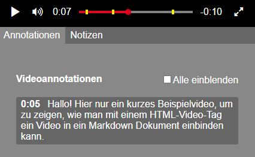
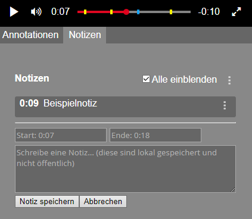

# elearnvideo.js

The _elearnvideo.js_ was developed as extension for
[elearn.js](https://github.com/elb-min-uhh/elearn.js), but it is possible to
use it without _elearn.js_. The framework _jQuery_ is necessary for
_elearnvideo.js_ to work correctly.

## Usage

If you want to use _elearnvideo.js_ with _elearn.js_ it is recommended to
use the [atom-elearnjs](https://github.com/elb-min-uhh/atom-elearnjs)
package.

To use _elearnvideo.js_ there are multiple possibilities described below.

If included every `<video>` will become a _elearnvideo_.
To prevent a specific video becoming a _elearnvideo_ you can add the class
`ignore_elearnvideo` to the `<video>`:

    <video class="ignore_elearnvideo">

### With _elearn.js_

With _elearn.js_ the easiest way to use _elearnvideo.js_ is the
[atom-elearnjs](https://github.com/elb-min-uhh/atom-elearnjs) package for
_Atom_. You can simply insert a `<video>` in your markdown file and
the package will include _elearnvideo.js_ automatically, when detected.

The file [example.md](/example.md) was created for the _atom-elearnjs_
package. It will result in a basic _elearn.js_ script including the
_elearnvideo_.

### Manually

To add _elearnvideo.js_ manually to your HTML file, add the following to the
`<head>`:

    <link rel="stylesheet" type="text/css" href="assets/css/elearnvideo.css">
    
    

__Hint:__ The files are in the _assets_ folder. You might have to change the
attributes _href_/_src_, when copied to another directory.
It is recommended to keep the structure so included _css_ files can use linked
fonts.

### Additional Features

Besides the own design, _elearnvideo.js_ has additional features.

#### Video Annotations

You can add video annotations to the video. Those will be displayed below it,
at specific times. Notes will not be visible in _fullscreen_ (check _hinted_
below). On the progress bar the notes will be hinted anyways with a yellow marker.

To add annotations like this you have to add the following directly below the
`<video>`:

    

        // Notizen hier einfügen
    

The class `timestamps` will add a small timestamp, when displaying a note.
Removing this, will display the note as is.

To add notes you have to add blocks like this:

    

        This is a note text.
    

The attribute `timefrom` has to be set, the attribute `timeto` is optional.
If `timeto` is not set, the note will not be hidden.
You can write the time in a simple format. Simply write a number you like and
the unit you like (one character) like `1h30s` for _1 hour and 30 seconds_ or
`5m` for _5 minutes_.
If you leave out the unit, the number will be interpreted as seconds:
`15` for _15 seconds_.

You can insert any HTML in this notes.

##### Hint the Note in the Video

To add a hint into the video, you can add the class `hinted` to the note:

    

Clicking on the hint will stop the video, close fullscreen and animate the note
background to emphasize it.

##### Automatic Stop

From _v0.4.2_ on you can automatically stop a video at a note, without user
interaction. Add the class `stopping` to the note as before:

    

This function might not be supported on any device. It is recommended to always
add the `hinted` class as above, when using `stopping`, so users are not
irritated by a suddenly stopping video.

A stopping video can be useful, when you want you want the user to solve
_quiz_ elements at specific points in the video.

#### User Notes

It is possible, to let the user write his own notes to the video.

To allow this, add the class `allow_user_notes` to the `<video>`.

    <video class="allow_user_notes">
        ...
    </video>

This notes will work just like the annotations. User notes are displayed with
a blue marker on the progress bar.

Because notes are only stored in the local storage, they can be exported and
imported as JSON or CSV. This way users can backup their notes without relying
on the browser. Also notes can be shared this way.

## Supported Languages

The _elearnvideo.js_ supports a simple language selection. The default language
is _german_. To change it, you can do one of the following:

1. A `lang` attribute will cause this node and all included _elearnvideo.js_ nodes to
appear in the selected language. E.g. `<html lang="en">` to change the language
for the whole document. It is recommended to use the `lang` attribute only
on the `<html>` element and nowhere else because you will get an inconsistent
document. Changing the `lang` attribute after the document was
loaded will not change already localized elements. Use method _2_ for this.
2. The `eLearnVideoJS.setLanguage("en")` function can be used to set the language from
inside a script. You can use this for _atom-elearnjs_ projects in the
_meta custom_ block. This may be overwritten by the first method if present.

Available languages are:
* _de_: German (default)
* _en_: English

## Example

A basic example with user notes:

    <video preload="auto" controls="controls" class="allow_user_notes">
            <source src="assets/media/example.mp4" type="video/mp4"></source>
            <source src="assets/media/example.webm" type="video/webm"></source>
            Your browser does not support this video.
    </video>
    

        <h4>Video Annotations</h4>
        

            First simple note.
        

        

            Second note. This one will stop the video automatically.
        

    

A working example https://elb-min-uhh.github.io/elearnvideo.js/.

## License

_elearnvideo.js_ is developed by
[dl.min](https://www.min.uni-hamburg.de/studium/digitalisierung-lehre/ueber-uns.html)
of Universität Hamburg.

The software is using [MIT-License](http://opensource.org/licenses/mit-license.php).

cc-by Michael Heinecke, Arne Westphal, dl.min, Universität Hamburg
